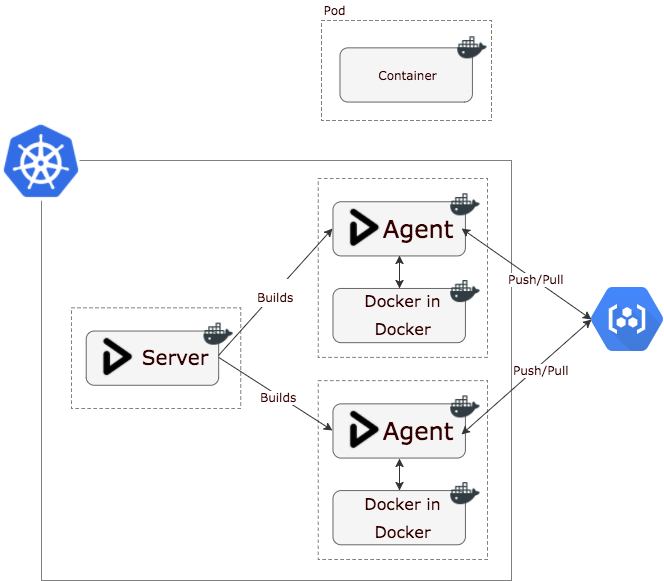
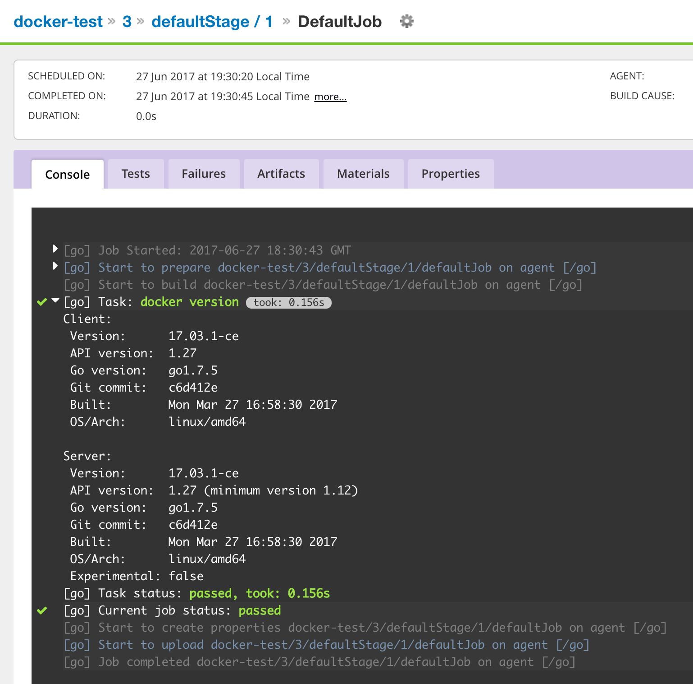

# GoCD on Kubernetes (GKE) with Docker (in docker) 

## History
[Previously](https://github.com/Stono/ci-in-a-box), I had been running GoCD agents in docker containers, and then volume mounting the docker socket from the host, so that the agents could build and deploy docker containers.

This had multiple problems:
 
  - Mounting the host docker process is in no way isolated, and privilege escalation is a massive problem
  - Running on kubernetes, you had access to the underlying kubernetes machine and could destroy your cluster quite easily
  - Agents weren't isolated, so a build job on one agent could affect a build job on another
  - Things like volume mounts don't work, they'd be mounting from your agents host machine, rather than from the agents filesystem
  - We are limited to the version of docker on the host, which for Google Container Engine (managed kubernetes) is quite old, so we're missing cool features

### Docker in Docker 
So I started looking at [docker in docker](https://hub.docker.com/_/docker/) and thought it would be nice if my gocd agents ran their own docker daemon, totally isolated, no reason to have access to the host they're running on.

The idea on kubernetes is that your kubernetes agent pod has two containers, one is the gocd-agent itself, the other is docker-in-docker, they scale linearly, so each agent gets its own unique docker daemon.  The gocd-agent talks to the docker daemon via TCP.

Docker in Docker carries its own problems, theres a good blog post on [here](https://jpetazzo.github.io/2015/09/03/do-not-use-docker-in-docker-for-ci/), however the dind image is now officially supported, albeit a little slower (as you're doing filesystems on top of filesystems).

#### In a diagram
It's probably easier to digest as a diagram.  Each agent builds against it's own isolated docker, and then pushes the build artifact up to the container registry.

### Shared volumes
You'll notice that both in docker-compose and kubernetes, I share a volume (/godata) between docker-in-docker, and the agent.  The reason for this is because if your agent runs a job, which does say, `docker run --rm -it -v $PWD:/test centos:7 /bin/bash`, it'd actually mount `$PWD` from the dind container, rather than the agent.  By sharing this volume you can mount files from your build directory into the child container.

## Running/Deploying
The idea here is to get you up and running as quickly as possible with GoCD.  

Simply edit the `go.env` file to meet your requirements and then start it up using compose, or deploy to kubernetes.

Both options will run/deploy:

  - GoCD Server (17.6.0)
  - GoCD Agent (with docker-in-docker) 

### Authentication
You've probably noticed `GO_USERNAME` and `GO_PASSWORD` in `go.env`.  These values will be written to `/etc/go-users` on the GoCD server using `htpasswd`.  You will need to enable the authentication the first time you open GoCD by going to `/go/admin/security/auth_configs`.

### Customising your agent
In both situations, we build custom agent and master images - inheriting from the official GoCD images.  If you want to make changes to your agent, simple edit `agent/Dockerfile`

### docker-compose
To run using docker-compose, do:

  - docker-compose build
  - docker-compose up -d

Wait for GoCD to boot and then go to `http://127.0.0.1:8153`

### Kubernetes (on Google Container Engine)
I am presuming you have already deployed a kubernetes cluster on Google Container Engine.

To deploy to that cluster, do:
 
  - Make sure your gcloud cli locally is logged in, and targetting your gcloud project
  - Make sure you kubectl is configured to point at the cluster you wish to target
  - ./kubernetes-deploy.sh

Wait for GoCD to boot, and then access it on the service ip.  You can find the IP with `$(kubectl get services | grep master | awk '{print $2}')`.

You can remove GoCD from kubernetes by running `./kubernetes-remove.sh`

#### Persistence
Kubernetes makes use of StatefulSets to persist your agent, and server configuration.

**WARNING**: The PersistentVolumeClaims only live as long as your kubernetes cluster.  Should you blow away your kubernetes cluster you **will** destroy your gocd config and history too.  Make sure you have a backup strategy in place.

## The result
No more `-v /var/run/docker.sock:/var/run/docker.sock` on your agents! 

